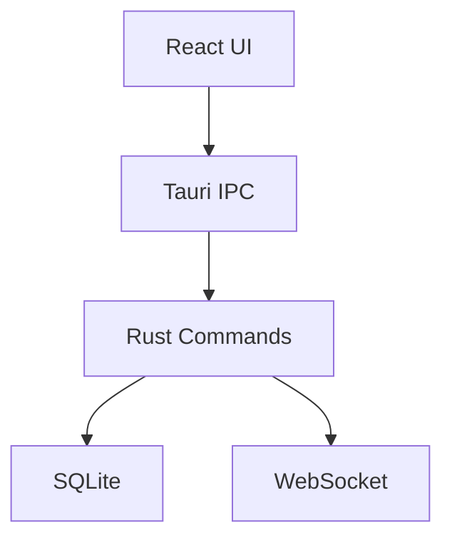

# 專案架構文檔 (@architecture.md)

> **Last Updated**: 2025-12-24
> **Version**: 1.1.0

## 1. 系統概覽

TaskRails 是一套 AI 協作開發編排系統，採用 Tauri (Rust + React) 架構。

## 2. 核心模組

### 2.1 Frontend (React + TypeScript)

- `components/features/`: 功能組件 (Kanban, AgentLab, Planner)
- `components/layout/`: 佈局組件 (Sidebar, Header)
- `hooks/`: 自定義 Hooks

### 2.2 Backend (Rust)

- `commands.rs`: Tauri IPC 命令
- `db.rs`: SQLite 資料庫操作
- `satellite/`: WebSocket 通訊模組
- `sentinel/`: 環境檢查與安全模組

## 3. 資料流

## 4. 關鍵設計決策

1. **Orchestrator Model**: 採用 v1.0 架構，AI 作為協調者而非執行者。
2. **Token-based Security**: Satellite 連線需攜帶 Bearer Token。
3. **Memory Bank**: 知識持久化採用檔案系統 + SQLite 混合模式。
