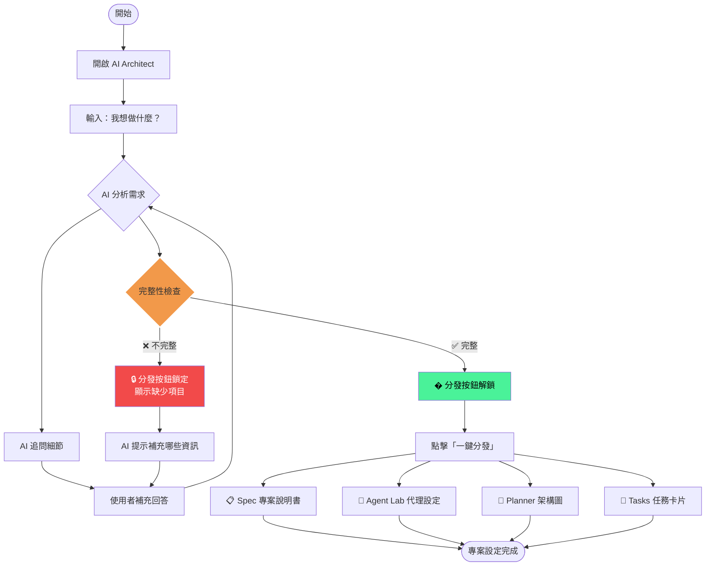
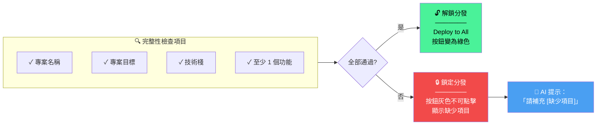
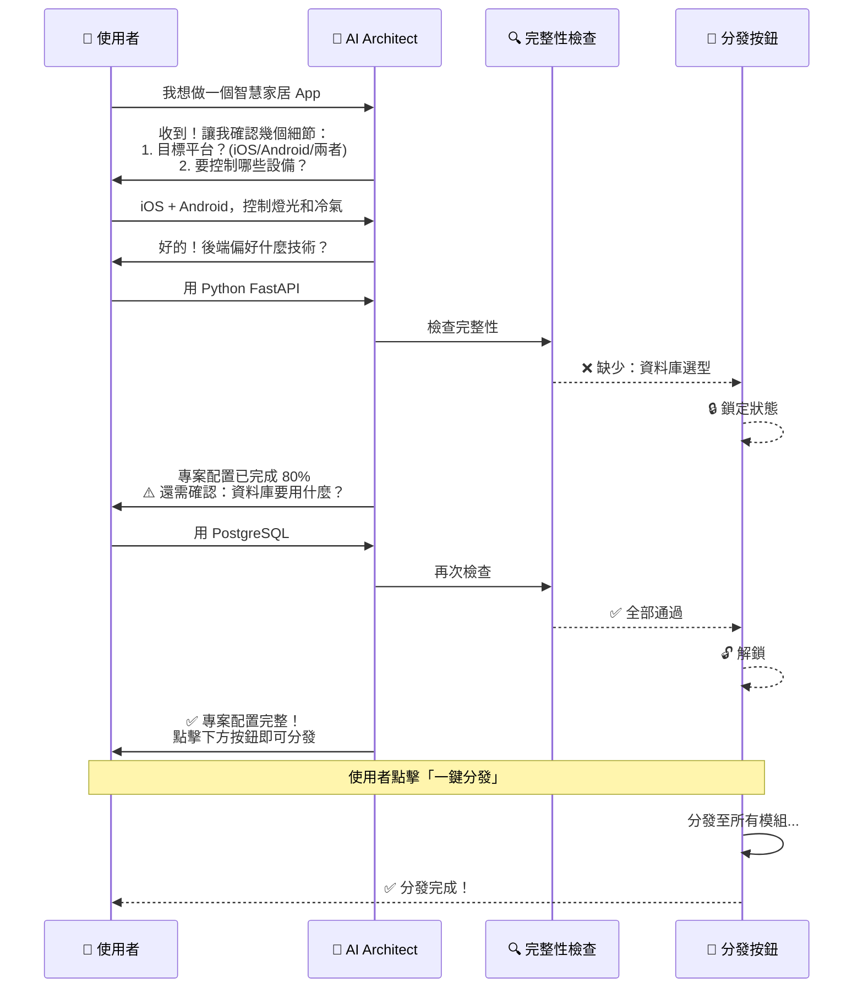
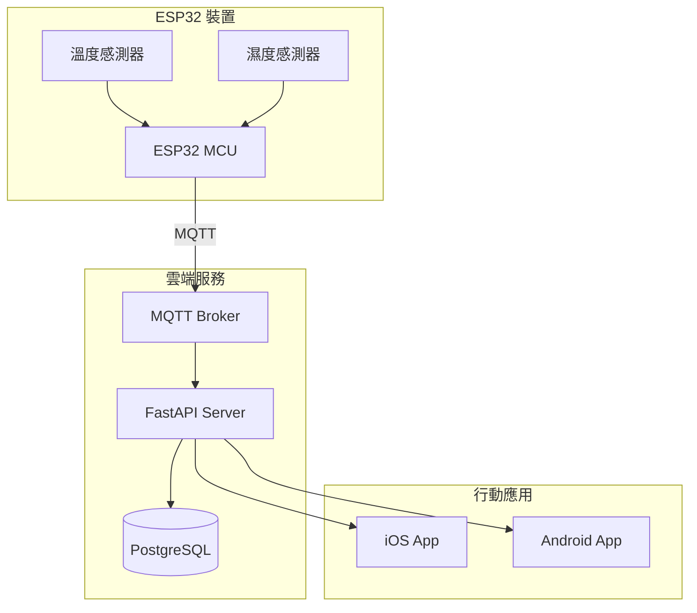

# TaskRails 新專案設定使用者說明書

> **版本**: v1.1  
> **適用版本**: TaskRails v1.1+  
> **最後更新**: 2025-12

---

## 📖 目錄

1. [概述](#1-概述)
2. [核心流程圖](#2-核心流程圖)
3. [操作步驟](#3-操作步驟)
4. [AI 自動生成內容](#4-ai-自動生成內容)
5. [完整性檢查機制](#5-完整性檢查機制)
6. [分發後微調](#6-分發後微調)
7. [常見問題](#7-常見問題)

---

## 1. 概述

TaskRails 提供極簡的專案設定體驗：

> **您只需要告訴 AI：「我想做什麼？」**  
> AI 會追問細節，確認完整後，一鍵分發至所有模組。

### 核心原則

| 原則               | 說明                     |
| ------------------ | ------------------------ |
| 🎯 **單一入口**    | 只需在 AI Architect 對話 |
| 🔄 **AI 主動追問** | 缺少資訊時 AI 會追問     |
| ✅ **完整性把關**  | 不完整時無法分發         |
| 📤 **一鍵分發**    | 完整後一鍵填充所有模組   |

---

## 2. 核心流程圖

### 2.1 主流程



### 2.2 完整性檢查流程



### 2.3 對話互動時序



---

## 3. 操作步驟

### STEP 1: 開啟 Project Setup Hub

點擊側邊欄 **Execution > Project Setup** (標有 NEW 徽章) 開啟專案設定中樞。

> 💡 **新功能**: Project Setup Hub 是一個內嵌頁面，直接在主視窗中操作，無需開啟獨立視窗。

### STEP 2: 描述您想做什麼

只需要一句話描述您的想法：

```
我想做一個 [產品類型]
```

**範例**：

- 「我想做一個記帳 App」
- 「我想做一個 ESP32 環境監測系統」
- 「我想做一個部落格網站」

### STEP 3: 回答 AI 追問

AI 會根據您的描述追問必要的細節：

| AI 可能追問的問題    | 目的         |
| -------------------- | ------------ |
| 「目標平台是什麼？」 | 確定技術方向 |
| 「主要功能有哪些？」 | 定義開發範圍 |
| 「偏好什麼技術棧？」 | 決定工具鏈   |
| 「有什麼特殊需求？」 | 補充約束條件 |

### STEP 4: 等待完整性檢查通過

當 AI 收集到足夠資訊：

- **通過**：分發按鈕變為 **綠色**，可點擊
- **未通過**：分發按鈕為 **灰色**，AI 會提示缺少什麼

### STEP 5: 一鍵分發

點擊 **「Deploy to All」** 按鈕，內容自動分發至：

| 模組         | 分發內容                                     |
| ------------ | -------------------------------------------- |
| 📋 Spec      | 專案名稱、目標、技術棧、功能清單、設計、規則 |
| 🤖 Agent Lab | 專案所需的 AI 代理配置                       |
| 📅 Planner   | 系統架構圖 (Mermaid)                         |
| 📌 Tasks     | 開發任務卡片 (注入看板)                      |

---

## 4. AI 自動生成內容

### 4.1 生成時機

當您與 AI 對話時，AI 會 **即時生成** 各模組的內容：

```mermaid
flowchart LR
    subgraph TALK["💬 對話過程"]
        A[使用者描述需求] --> B[AI 追問細節]
        B --> C[使用者補充]
        C --> B
    end

    subgraph GEN["⚙️ 背景生成"]
        D["📋 Spec<br>專案說明書"]
        E["🤖 Agents<br>代理配置"]
        F["📅 Diagrams<br>架構圖表"]
        G["📌 Tasks<br>任務清單"]
    end

    TALK -->|"即時生成"| GEN

    style GEN fill:#1a1a2e,stroke:#4AF299
```



> 💡 您不需要分別告訴 AI 生成什麼，AI 會根據對話內容 **自動規劃並生成所有模組的內容**。

### 4.2 生成內容一覽

| 模組             | AI 自動生成的內容                                              | 範例                                        |
| ---------------- | -------------------------------------------------------------- | ------------------------------------------- |
| 📋 **Spec**      | 專案名稱、目標、技術棧、資料結構、功能清單、設計規範、工程規則 | 完整的專案說明書                            |
| 🤖 **Agent Lab** | 專案所需的 AI 代理及其 System Prompt                           | `Firmware Dev`, `Backend Dev`, `Mobile Dev` |
| 📅 **Planner**   | 系統架構流程圖、資料庫 ER 圖、狀態圖                           | Mermaid 格式的圖表程式碼                    |
| 📌 **Tasks**     | 開發任務卡片，含階段、優先級                                   | `Phase 1: 基礎設施 (4 tasks)`               |

### 4.3 Agent 生成邏輯

AI 會根據專案類型 **自動規劃適合的 Agent 組合**：

| 專案類型       | AI 可能生成的 Agent                         |
| -------------- | ------------------------------------------- |
| **Web App**    | `Frontend Dev`, `Backend Dev`, `DevOps`     |
| **Mobile App** | `iOS Dev`, `Android Dev`, `API Designer`    |
| **IoT 專案**   | `Firmware Dev`, `Backend Dev`, `Mobile Dev` |
| **桌面應用**   | `Rust Expert`, `UI Designer`, `QA Tester`   |
| **ML 專案**    | `Data Engineer`, `ML Engineer`, `Infra`     |

每個 Agent 包含：

- **名稱與角色定位**
- **技能標籤** (如 `esp-idf`, `mqtt`, `react`)
- **System Prompt** (定義 AI 行為)

### 4.4 圖表生成邏輯

AI 會根據專案架構 **自動生成 Mermaid 圖表**：

| 圖表類型             | 用途            | 生成條件         |
| -------------------- | --------------- | ---------------- |
| **Flowchart**        | 系統架構/資料流 | 預設生成         |
| **Sequence Diagram** | API 互動時序    | 有多元件互動時   |
| **ER Diagram**       | 資料庫結構      | 有資料儲存需求時 |
| **State Diagram**    | 狀態機          | 有複雜狀態轉換時 |
| **Class Diagram**    | 類別結構        | 有 OOP 設計時    |

#### Planner 介面功能

AI 生成的圖表會分發至 Planner 模組，提供以下功能：

| 功能           | 說明                                          |
| -------------- | --------------------------------------------- |
| **Tab 切換**   | 多張圖表以 Tab 形式呈現，點擊切換             |
| **Popup View** | 獨立視窗放大檢視圖表                          |
| **即時編輯**   | 左側編輯器可修改 Mermaid 程式碼，右側即時預覽 |
| **Save Plan**  | 儲存圖表至專案                                |

```
┌─────────────────────────────────────────────────────────────┐
│ 🗺️ Workflow Visualizer              [Popup View] [Save Plan]│
├─────────────────────────────────────────────────────────────┤
│ [ 系統架構圖 ] [ 資料庫 ER ] [ API 時序 ] ← Tab 切換         │
├───────────────────────┬─────────────────────────────────────┤
│   Mermaid Syntax      │      Graph Render                   │
│   ─────────────────   │      ─────────────────              │
│   graph TD            │         ┌─────┐                     │
│     A --> B           │    ┌────│  A  │────┐                │
│     B --> C           │    ↓    └─────┘    ↓                │
│     ...               │  ┌───┐          ┌───┐               │
│                       │  │ B │          │ C │               │
│                       │  └───┘          └───┘               │
└───────────────────────┴─────────────────────────────────────┘
```

#### Popup View 使用方式

1. 點擊 **Popup View** 按鈕開啟獨立視窗
2. 視窗內有 Tab 可切換不同圖表
3. 使用左右箭頭快速切換
4. 點擊 X 或 ESC 關閉視窗

**範例：IoT 專案自動生成的架構圖**



### 4.5 任務生成邏輯

AI 根據功能清單 **自動拆解為可執行任務**：

```
功能：「燈光控制」
        ↓ AI 拆解
┌─────────────────────────────────────┐
│ Phase 1: 基礎設施                    │
│ ├── TSK-001: 建立 ESP32 專案結構      │
│ ├── TSK-002: 實作 WiFi 配網功能       │
│ └── TSK-003: 設定 MQTT 連線          │
├─────────────────────────────────────┤
│ Phase 2: 核心功能                    │
│ ├── TSK-004: 實作 LED 控制 API        │
│ ├── TSK-005: 開發手機端控制介面       │
│ └── TSK-006: 整合測試                │
└─────────────────────────────────────┘
```

---

## 5. 完整性檢查機制

### 5.1 必填項目

以下項目 **必須** 完成才能分發：

| 項目        | 說明       | 檢查標準       |
| ----------- | ---------- | -------------- |
| ✅ 專案名稱 | 識別專案用 | 非空字串       |
| ✅ 專案目標 | 核心願景   | 至少 20 字描述 |
| ✅ 技術棧   | 開發工具   | 至少 1 項技術  |
| ✅ 功能清單 | 開發範圍   | 至少 1 個功能  |

### 5.2 選填項目

以下項目 **可選**，AI 會使用預設值：

| 項目       | 預設行為                          |
| ---------- | --------------------------------- |
| 資料結構   | AI 根據功能推斷                   |
| 設計規範   | 使用預設深色主題                  |
| 工程規則   | 使用通用最佳實踐                  |
| Agent 配置 | 生成預設 Coder/Reviewer/Architect |

### 5.3 未通過時的 UI 狀態

當完整性檢查 **未通過** 時：

```
┌─────────────────────────────────────────────────┐
│ � 專案配置進度                                  │
├─────────────────────────────────────────────────┤
│ ✅ 專案名稱：智慧家居控制中心                     │
│ ✅ 專案目標：透過手機控制家中 IoT 設備            │
│ ✅ 技術棧：React Native + FastAPI               │
│ ❌ 功能清單：尚未定義                            │
├─────────────────────────────────────────────────┤
│ ⚠️ 請補充功能清單後才能分發                       │
├─────────────────────────────────────────────────┤
│      [ Deploy to All ] ← 灰色不可點擊            │
└─────────────────────────────────────────────────┘
```

AI 會主動詢問：

> 「請告訴我這個 App 的主要功能有哪些？例如：燈光控制、溫度監測...」

### 5.4 通過時的 UI 狀態

當完整性檢查 **通過** 時：

```
┌─────────────────────────────────────────────────┐
│ ✅ 專案配置完整！                                │
├─────────────────────────────────────────────────┤
│ ✅ 專案名稱：智慧家居控制中心                     │
│ ✅ 專案目標：透過手機控制家中 IoT 設備            │
│ ✅ 技術棧：React Native + FastAPI + PostgreSQL │
│ ✅ 功能清單：5 項功能已定義                       │
├─────────────────────────────────────────────────┤
│ 🤖 將建立 3 個 Agent                            │
│ 📅 將生成 2 張架構圖                             │
│ 📌 將建立 12 個任務                              │
├─────────────────────────────────────────────────┤
│      [ Deploy to All ] ← 綠色可點擊 🟢           │
└─────────────────────────────────────────────────┘
```

---

## 6. 分發後微調

分發完成後，您可以在各模組中微調內容：

| 模組         | 路徑                        | 可調整內容              |
| ------------ | --------------------------- | ----------------------- |
| 📋 Spec      | Planning > Specs            | 編輯任何欄位            |
| 🤖 Agent Lab | Planning > Agent Lab        | 調整技能、System Prompt |
| 📅 Planner   | Planning > Planner          | 編輯 Mermaid 圖表       |
| 📌 Tasks     | Execution > Mission Control | 調整優先級、描述        |

---

## 7. 常見問題

### Q1: 分發按鈕一直是灰色的？

**原因**：完整性檢查未通過。

**解決**：

1. 查看對話視窗中的「專案配置進度」區塊
2. 找到帶有 ❌ 的項目
3. 回答 AI 的追問補充該項目

---

### Q2: AI 追問太多問題怎麼辦？

**解決**：您可以一次性提供多項資訊：

```
👤 使用者：
我想做一個記帳 App，
用 React Native 開發，
後端用 Firebase，
功能包含：收支記錄、圖表分析、預算提醒
```

這樣 AI 就不需要逐一追問了。

---

### Q3: 可以跳過某些追問嗎？

**可以**，只要必填項目完成即可。

對於選填項目，您可以說：

> 「這個先用預設的」

AI 會使用合理的預設值。

---

### Q4: 分發後發現內容不對怎麼辦？

**兩種方式**：

1. **直接編輯**：到對應模組手動修改
2. **重新分發**：回到 AI Architect，說「重新生成 [模組名稱]」

---

### Q5: 可以只分發到特定模組嗎？

**可以**。完整性通過後，除了「Deploy to All」，還會有個別按鈕：

- `Deploy to Spec`
- `Deploy Agents`
- `Deploy Plan`
- `Deploy Tasks`

---

## � 附錄：完整性檢查清單

| 類別     | 項目       | 必填 | 檢查標準   |
| -------- | ---------- | :--: | ---------- |
| **基本** | 專案名稱   |  ✅  | 非空       |
| **基本** | 專案目標   |  ✅  | ≥ 20 字    |
| **技術** | 技術棧     |  ✅  | ≥ 1 項     |
| **功能** | 功能清單   |  ✅  | ≥ 1 項     |
| **資料** | 資料結構   |  ⬜  | AI 推斷    |
| **設計** | UI/UX 規範 |  ⬜  | 預設主題   |
| **規則** | 工程規則   |  ⬜  | 通用規範   |
| **代理** | Agent 配置 |  ⬜  | 預設三角色 |

> ✅ = 必填, ⬜ = 選填 (有預設值)

---

_© 2025 TaskRails. MIT License._
